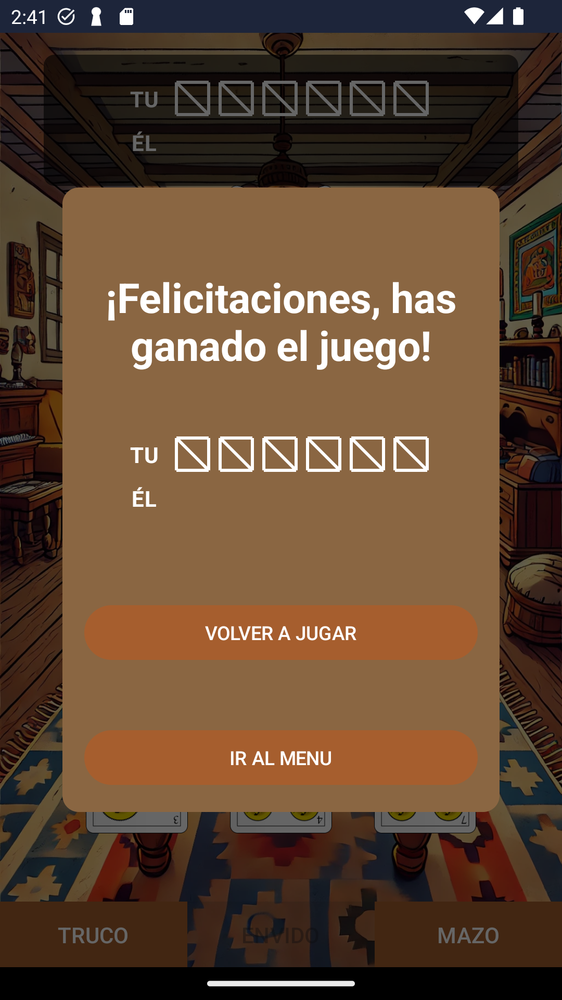

# ¡Que Trucazo!

¡Bienvenido a Que Trucazo! Este es un juego de cartas en línea que te permite jugar al truco con tus amigos y otros jugadores de todo el mundo.

## Características

- **Registro e inicio de sesión**: Crea tu cuenta o inicia sesión para empezar a jugar.
- **Listado de juegos**: Ve y únete a juegos disponibles.
- **Juego en tiempo real**: Juega al truco en tiempo real con otros jugadores.
- **Interfaz de usuario amigable**: Interfaz intuitiva y fácil de usar.
- **Funciones del juego**:
  - Cantar envido
  - Cantar truco
  - Responder a los cantos del oponente
  - Jugar cartas
  - Ver resultados del juego
- **Esperando al oponente**: Pantallas de espera amigables mientras se conecta el oponente.

## Capturas de Pantalla

  
  
  

  
  
  

  
  
  

  
  
  

  
  

## Cómo Jugar

1. **Registro**: Crea una cuenta con tu correo electrónico.
2. **Iniciar sesión**: Ingresa con tus credenciales.
3. **Unirse a un juego**: Selecciona un juego de la lista de juegos disponibles o crea uno nuevo.
4. **Jugar**: Sigue las reglas del truco, canta envido, truco y responde a los cantos del oponente.
5. **Disfrutar**: ¡Diviértete jugando al truco en línea con tus amigos!

## Ejecutar el Proyecto

El servidor se encuentra online por lo que no es necesario ejecutarlo, es suficiente con ejecutar el proyecto de Android Studio. De todos modos, si se quiere ejecutar localmente seguir los pasos dentro del [README](./server/README.md) del servidor.

## Licencia

Este proyecto está licenciado bajo la [MIT License](LICENSE).
